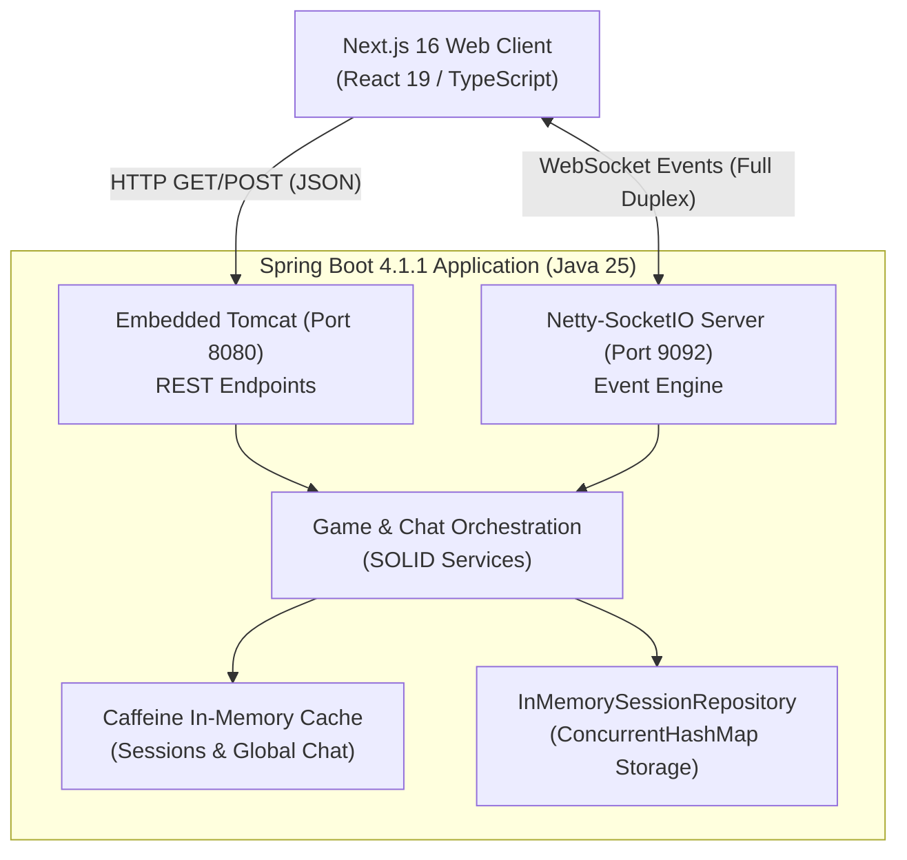
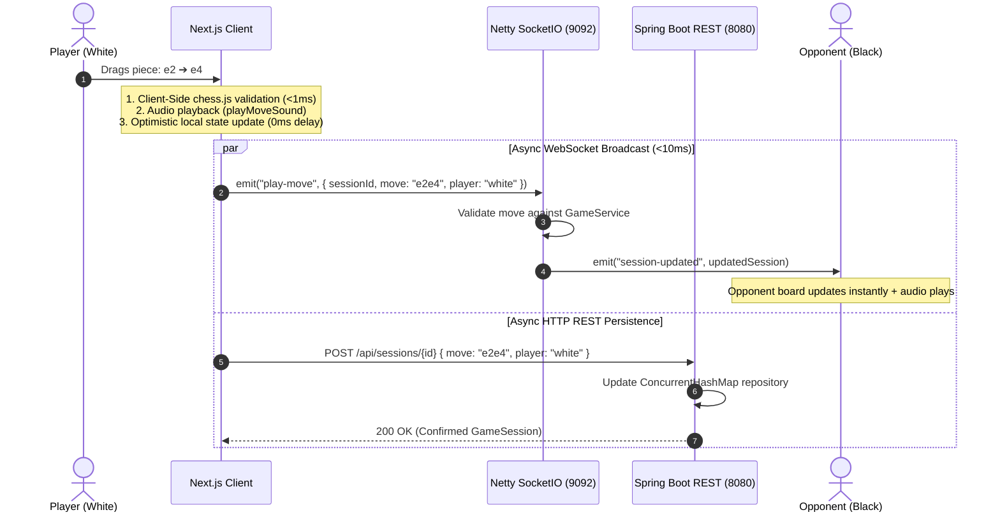

# 01 — System Architecture Overview

## 1. System Topology

ByteMate / ChessTogether is structured as a decoupled, full-stack real-time web application. The platform uses a dual-protocol transport layer (HTTP REST + Netty WebSockets) to balance data durability, caching, and ultra low-latency interactive gameplay.

---

## 2. Ports & Network Interfaces

| Service | Port | Protocol | Purpose |
|---|---|---|---|
| **Next.js Frontend** | `3000` | HTTP / HTTPS | UI rendering, SSG pages, static assets, client-side routing. |
| **Spring Boot REST** | `8080` | HTTP (JSON) | Session management, REST fallbacks, chat history retrieval, CORS handling. |
| **Netty-SocketIO Server** | `9092` | WebSocket / TCP | High-throughput bi-directional event stream for chess moves and live chat. |

---

## 3. End-to-End Move Execution Lifecycle

The platform uses an **optimistic UI + dual sync** pattern to deliver instantaneous feedback while ensuring server-authoritative integrity:

---

## 4. Architectural Boundaries

### 1. Presentation & Interaction Boundary (Client)
- Responsible for all direct user inputs: touch gestures, drag-and-drop piece manipulation, click-to-move detection, and Markdown rendering.
- Executes local pre-validation via `chess.js` to guarantee immediate UI responses and eliminate round-trip latency on user actions.
- Manages audio synthesis and Web Audio caching for feedback cues.

### 2. Real-Time Transport Boundary (Netty-SocketIO)
- Dedicated NIO (Non-blocking I/O) server built with Netty worker threads.
- Isolates clients into discrete room channels (`session:<id>` and global lobby).
- Processes events without blocking Spring HTTP worker threads.

### 3. Business Logic & Validation Boundary (Spring Service Layer)
- Enforces chess movement rules and game-state transitions (checkmate, draw, turns) using `chessgame` engine.
- Implements SOLID interfaces to decouple storage, ID generation, chat, and validation.

### 4. Caching & Persistence Boundary (Caffeine + Concurrent Storage)
- Uses Caffeine in-memory cache to eliminate repetitive calculations and serialization on high-frequency read endpoints (`/api/sessions`, `/api/chat/global`).
- Manages thread-safe match states in `ConcurrentHashMap` with atomic updates.

---

## 5. Latency & Performance Matrix

| Metric | Target | Actual Performance | Mechanism |
|---|---|---|---|
| **Local Move Reaction** | `< 16ms` (1 frame) | **`0ms` (Instant)** | Optimistic React state update before network request. |
| **WebSocket Broadcast** | `< 50ms` | **`< 10ms`** | Netty event-loop NIO architecture on dedicated port. |
| **REST Cache Hits** | `< 10ms` | **`1-3ms`** | Caffeine In-Memory Cache with zero disk/database I/O. |
| **Learn Page Load** | `< 100ms` | **Instant SSG** | Pre-rendered static HTML via Next.js build-time Markdown parsing. |
| **Spring Boot Startup** | `< 5.0s` | **`1.54s`** | Streamlined component scanning, Java 25 runtime optimizations. |
