# 03 — Backend SOLID Architecture & Caching

## 1. Overview & Stack

The ByteMate backend is built with **Java 25** and **Spring Boot 4.1.1**, structured around strict **SOLID principles** and high-performance in-memory state management.

```
┌────────────────────────────────────────────────────────────────────────┐
│                        Spring Boot Application                         │
├─────────────────────┬──────────────────────────┬───────────────────────┤
│  Controller Layer   │      Service Layer       │   Storage & Cache     │
├─────────────────────┼──────────────────────────┼───────────────────────┤
│ • SessionController │ • GameServiceImpl        │ • InMemorySessionRepo │
│ • ChatController    │ • ChatServiceImpl        │ • Caffeine Cache      │
│ • GlobalExceptHndlr │ • ChessMoveValidator     │ • SecureRandomIdGen   │
│ • SocketIO Runner   │ • SocketEventHandlers    │ • ConcurrentHashMap   │
└─────────────────────┴──────────────────────────┴───────────────────────┘
```

---

## 2. SOLID Design Principles in Practice

```mermaid
classDiagram
    class GameService {
        <<interface>>
        +createSession(whiteName, blackName) GameSession
        +submitMove(sessionId, player, moveStr) MoveResult
    }
    class SessionQueryService {
        <<interface>>
        +getSession(id) Optional~GameSession~
        +getActiveSessions() List~SessionSummary~
    }
    class SessionChatService {
        <<interface>>
        +addMessageToSession(sessionId, sender, role, text, avatar) ChatMessage
    }
    class GlobalChatService {
        <<interface>>
        +addGlobalMessage(sender, role, text, avatar) ChatMessage
        +getGlobalMessages() List~ChatMessage~
    }
    class SessionRepository {
        <<interface>>
        +save(session) GameSession
        +findById(id) Optional~GameSession~
        +findAll() Collection~GameSession~
    }
    class IdGenerator {
        <<interface>>
        +generate() String
    }
    class MoveValidationService {
        <<interface>>
        +validate(game, moveStr) ValidatedMove
    }

    GameServiceImpl ..|> GameService
    GameServiceImpl ..|> SessionQueryService
    ChatServiceImpl ..|> SessionChatService
    ChatServiceImpl ..|> GlobalChatService
    InMemorySessionRepository ..|> SessionRepository
    SecureRandomIdGenerator ..|> IdGenerator
    ChessMoveValidationService ..|> MoveValidationService

    GameServiceImpl --> SessionRepository : DIP
    GameServiceImpl --> IdGenerator : DIP
    GameServiceImpl --> MoveValidationService : DIP
    GameServiceImpl --> SessionChatService : DIP
```



### 1. Single Responsibility Principle (SRP)
Each class has one and only one reason to change:
- `GameServiceImpl`: Orchestrates game lifecycle and turn progression. Does not handle ID generation, storage, or low-level chess move validation directly.
- `ChatServiceImpl`: Manages chat messages only. Zero game logic.
- `InMemorySessionRepository`: Manages data storage in memory. Zero validation or business rules.
- `SecureRandomIdGenerator`: Generates random identifiers.
- `ChessMoveValidationService`: Validates move strings against chess rule engines.

### 2. Open/Closed Principle (OCP)
- `MoveValidationService`: Abstracted behind an interface. New move notations (e.g. FEN, SAN, UCI, LAN) can be introduced or modified by providing alternative validator implementations without altering `GameServiceImpl`.

### 3. Liskov Substitution Principle (LSP)
- `SessionRepository` and `IdGenerator` can be substituted with persistent database drivers (e.g., PostgreSQL, Redis, DynamoDB) without changing any code in the service or controller layers.

### 4. Interface Segregation Principle (ISP)
- Rather than a bloated `SessionService` interface, the system provides narrow, segregated interfaces:
  - `GameService`: For game mutations (creation and moves).
  - `SessionQueryService`: For read-only session inspection.
  - `SessionChatService`: For session-scoped chat messaging.
  - `GlobalChatService`: For global lobby messaging.

### 5. Dependency Inversion Principle (DIP)
- Controllers (`SessionController`, `ChatController`) and socket handlers (`GameSocketHandler`) depend purely on abstract interfaces injected via constructor injection. No concrete instantiation with `new` in business logic.

---

## 3. High-Speed Caffeine In-Memory Caching

ByteMate leverages **Caffeine In-Memory Cache** (`com.github.ben-manes.caffeine`) configured via `CacheConfig`:

```java
@Configuration
@EnableCaching
public class CacheConfig {

    public static final String ACTIVE_SESSIONS_CACHE = "activeSessions";
    public static final String GLOBAL_CHAT_CACHE = "globalChat";

    @Bean
    public CacheManager cacheManager() {
        CaffeineCacheManager manager = new CaffeineCacheManager(
                ACTIVE_SESSIONS_CACHE,
                GLOBAL_CHAT_CACHE
        );
        manager.setCaffeine(Caffeine.newBuilder()
                .maximumSize(500)
                .expireAfterWrite(5, TimeUnit.MINUTES)
                .recordStats());
        return manager;
    }
}
```

### Cache Invalidation & Immutability Patterns:
1. **Mutation Invalidation (`@CacheEvict`)**:
   - `createSession(...)` evicts `activeSessions` cache.
   - `addGlobalMessage(...)` evicts `globalChat` cache.
2. **Snapshot Immutability Guarantee**:
   - `getActiveSessions()` and `getGlobalMessages()` return unmodifiable snapshots created via `List.copyOf(...)`. This guarantees cached state cannot be mutated by downstream callers.

---

## 4. Centralized Exception Handling

`GlobalExceptionHandler` uses Spring's `@RestControllerAdvice` to convert domain exceptions into consistent, well-formed JSON error responses:

| Exception | HTTP Status | Response Payload |
|---|---|---|
| `NoSuchElementException` | `404 Not Found` | `{"error": "Resource not found"}` |
| `IllegalStateException` | `400 Bad Request` | `{"error": "Not your turn / Invalid state"}` |
| `IllegalArgumentException` | `400 Bad Request` | `{"error": "Invalid move or parameters"}` |
| Generic `Exception` | `500 Internal Server Error` | `{"error": "An unexpected error occurred"}` |

---

## 5. Automated Verification & Testing Suite

All 13 unit and integration tests execute with zero failures:
```bash
mvn clean test
```

### Test Coverage:
- `CacheIntegrationTest`: Verifies Caffeine cache hits, eviction triggers, and immutability enforcement.
- `SessionServiceTest`: Verifies session creation, move progression, out-of-turn rejection, illegal move rejection, and checkmate detection.
