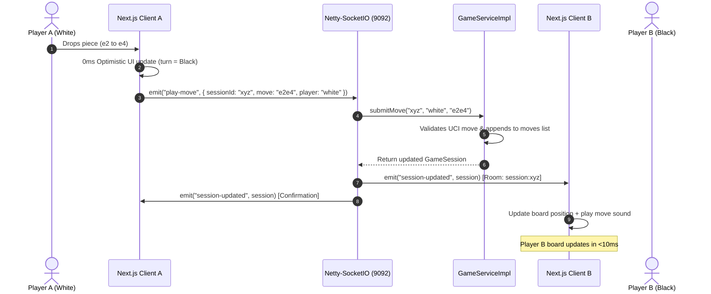

# 04 — Netty-SocketIO Real-Time WebSocket Engine

## 1. Overview & Technology Architecture

ByteMate uses **Netty-SocketIO** (`com.corundumstudio.socketio`), a high-throughput, non-blocking Java WebSocket server built on the high-performance Netty framework.

```
┌────────────────────────────────────────────────────────────────────────┐
│                   Netty-SocketIO Architecture (9092)                   │
├────────────────────────────────────────────────────────────────────────┤
│  [ Netty Boss Group ]  ──► Accepts inbound WebSocket connections       │
│  [ Netty Worker Group] ──► Reads/writes TCP frames asynchronously      │
│  [ Room Manager ]      ──► Isolates sessions into `session:<id>` rooms │
│  [ Socket Handlers ]   ──► GameSocketHandler & ChatSocketHandler       │
└────────────────────────────────────────────────────────────────────────┘
```

---

## 2. Server Lifecycle & Configuration

The server runs on port `9092` with local in-memory session management:

```java
@Configuration
public class SocketIOConfig {

    @Value("${socketio.host:0.0.0.0}")
    private String host;

    @Value("${socketio.port:9092}")
    private int port;

    @Bean
    public SocketIOServer socketIOServer() {
        com.corundumstudio.socketio.Configuration config =
                new com.corundumstudio.socketio.Configuration();
        config.setHostname(host);
        config.setPort(port);
        config.setOrigin("*"); // Allow all origins for dev/prod flexibility
        return new SocketIOServer(config);
    }
}
```

---

## 3. WebSocket Event Protocol Reference

### 1. Game Session Events
| Event Name | Direction | Payload | Description |
|---|---|---|---|
| `join-session` | Client ➔ Server | `String sessionId` | Joins the room `session:<sessionId>` and sends current game snapshot. |
| `play-move` | Client ➔ Server | `PlayMoveEvent` (`sessionId`, `move`, `player`) | Submits a move for validation and broadcast. |
| `session-updated` | Server ➔ Client | `GameSession` | Emitted to all clients in the session room when a valid move occurs. |

### 2. Match & Global Chat Events
| Event Name | Direction | Payload | Description |
|---|---|---|---|
| `send-chat-message` | Client ➔ Server | `SendChatEvent` (`sessionId`, `sender`, `role`, `text`, `avatar`) | Submits a match chat message. |
| `new-chat-message` | Server ➔ Client | `ChatMessage` | Emitted to room members on new match chat message. |
| `send-global-chat` | Client ➔ Server | `SendLobbyChatEvent` (`sender`, `role`, `text`, `avatar`) | Submits a global lobby chat message. |
| `new-global-chat` | Server ➔ Client | `ChatMessage` | Broadcast to all connected clients on global lobby message. |

---

## 4. Real-Time Move Execution Sequence



---

## 5. Room Isolation Strategy

To ensure zero cross-talk between concurrent chess games:
1. When a client mounts the game page, it emits `join-session` with the `sessionId`.
2. The server calls `client.joinRoom("session:" + sessionId)`.
3. Move updates and match chat are dispatched exclusively using `server.getRoomOperations("session:" + sessionId).sendEvent(...)`.
4. Global lobby events are broadcast globally to all active sockets.

---

## 6. Fault Tolerance & Fallback Heartbeat

To ensure uninterrupted gameplay even during temporary network interruptions or WebSocket reconnects:
- **Automatic Reconnection**: `socket.io-client` automatically attempts reconnection on connection drop.
- **REST Background Polling**: A lightweight 2.5s polling loop (`/api/sessions/${sessionId}`) acts as a safety heartbeat to reconcile state if a packet is dropped on mobile networks.
